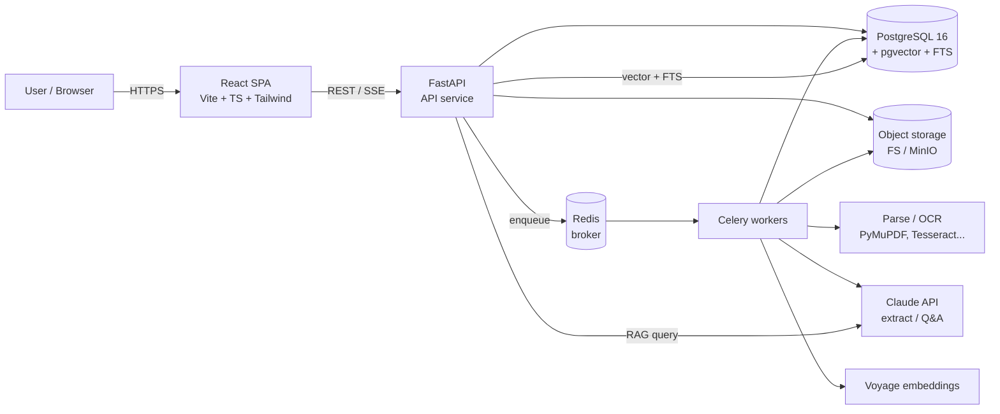
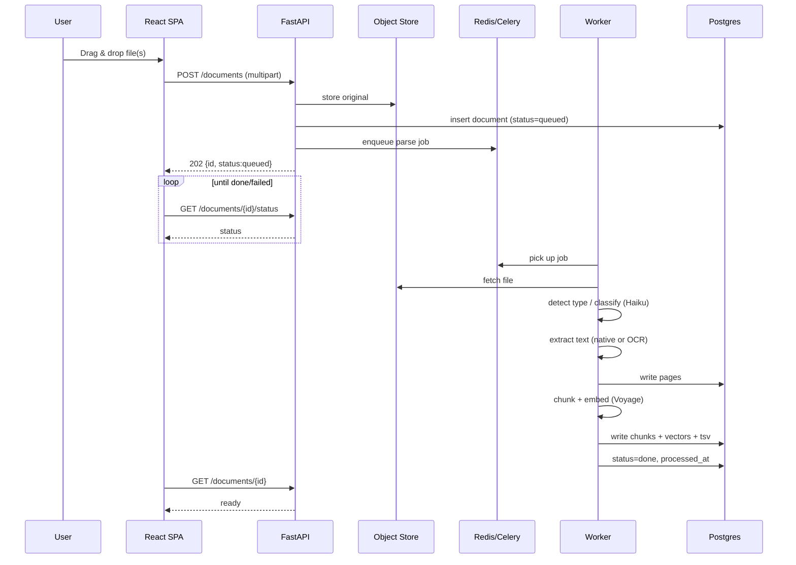
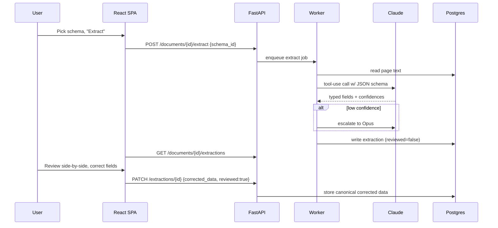
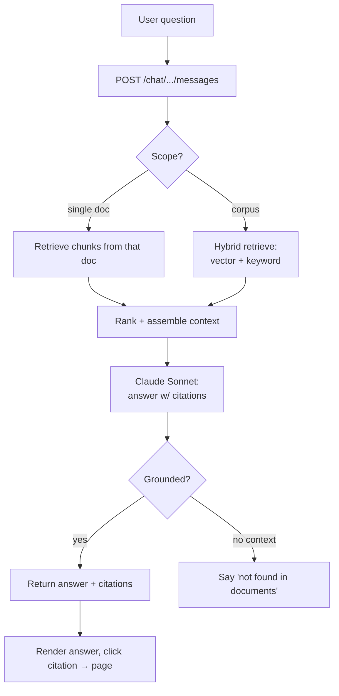
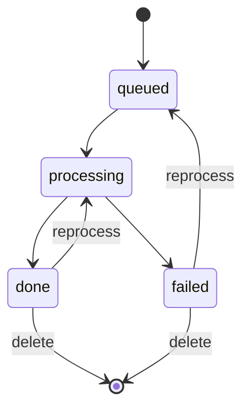

# 1. DocuParse Project Brief.md

# Project Brief — DocuParse

> **Type:** Internal / personal tool · **Status:** Brief v0.1
> **Sits above:** `PRD.md` (detailed requirements) · `TRD.md` (technical spec) · `BUILD-GUIDE.md` (how to build)
> **Working name:** "DocuParse" (placeholder)

## One-line pitch

An AI-first document parser that reads any document — invoices, contracts, forms, reports — understands its layout and visual elements, pulls out clean structured data, flags anything uncertain for a human, and pushes the results straight into the tools you already use.

## Background & problem

Getting reliable data out of documents is still mostly manual. The tools that exist tend to fail in one of two ways: the "dumb" ones flatten everything into a jumble of text and lose all structure, and the "rigid" ones need a hand-drawn template for every layout and break the moment a vendor nudges their design. Both leave you doing cleanup by hand, and neither can be trusted to feed data into anything important without someone double-checking.

DocuParse takes the opposite stance on every one of those failure points. It uses AI to *understand* documents rather than pattern-match fixed positions, preserves structure and visual context, classifies documents on its own, never silently trusts a guess, and treats "get the data out to where I need it" as a first-class feature rather than an afterthought.

## Vision

Drop in any document and get back trustworthy, structured, ready-to-use data — with zero template setup, zero manual sorting, and no silent errors — delivered automatically into the systems where the data actually needs to live.

## Who it's for

Primarily you and a small trusted circle running personal or internal operations: processing invoices, receipts, contracts, forms, and reports without the copy-paste grind. The design optimizes for **trust and control** (show confidence, allow correction) over consumer gloss.

## Guiding design principles

These six principles are the identity of the product. Each one is the deliberate inverse of a common failure mode. Every feature decision should trace back to one of them.

1. **Adaptive, not template-bound.** The parser learns document meaning with ML/LLMs. It adapts to new and changed layouts automatically — no bounding boxes, no per-vendor templates to maintain.
2. **Layout-aware, not flat text.** Reading order, paragraphs, headers, footers, and sidebars are preserved. Context is never flattened away.
3. **Structured & multimodal, not text-only.** Complex tables, multi-page grids, line items, and checkboxes come out clean — and charts, graphs, embedded images, and mathematical formulas are understood, not skipped.
4. **Self-classifying, not manually sorted.** The app identifies what each document is (invoice vs. contract vs. receipt) and routes it to the right workflow. You never pre-sort files into folders.
5. **Human-in-the-loop, never silently wrong.** Every extraction carries a confidence score. Low-confidence fields and anomalies are flagged for review before anything reaches a database. A confident guess that's wrong is treated as a bug, not an acceptable outcome.
6. **Open, not siloed.** Data flows out easily via a robust API, webhooks, and native integrations (Google Sheets, CRMs, ERPs). No closed system, no manual CSV shuffling.

## Core features (must-have)

| # | Feature | What it delivers |
|---|---|---|
| 1 | **AI-powered data extraction** | Pulls key-value pairs (names, totals, dates) automatically via ML/LLMs — no rigid manual templates. |
| 2 | **Layout-aware OCR** | Reads text while preserving reading order, paragraphs, headers, and footers. |
| 3 | **Complex table & checkbox extraction** | Parses intricate grids, line items, and checkboxes into usable CSV/JSON. |
| 4 | **Multimodal processing** | Analyzes charts, graphs, and mathematical formulas for full contextual understanding. |
| 5 | **Automated classification & routing** | Identifies document type and routes it to the correct workflow automatically. |
| 6 | **Data validation & confidence scores** | Flags low-confidence extractions and anomalies for human review before data lands. |
| 7 | **Native integrations & APIs** | Direct connections and webhooks to push parsed data into Sheets, CRMs, and ERPs instantly. |

## User experience & interface

The interface is what makes the AI trustworthy in practice. It's built around a **verification-first split-screen**: never make the user trust extracted data without an easy way to check it against the source.

- **Split-screen workspace.** Source document on the left (pan, zoom, highlight); structured data on the right. The two are **linked both ways** — selecting a field jumps the source to the exact spot via a bounding box, and selecting text/regions on the source populates or corrects a field (click-to-extract). This visual mapping is the product's signature.
- **Logical grouping.** Extracted data is organized into sections (Document Header, Line Items, Summary) to reduce cognitive load, with complex data shown as clean, spreadsheet-like tables (numbers right-aligned, text left-aligned).
- **Confidence made visible.** Low-confidence fields are clearly flagged (warning icon, faded text) so attention goes where it's needed; a control jumps straight to the next field needing review.
- **Fast verification & editing.** Click any field to fix it, drag on the source to capture the right text, and Approve or Reject/Flag each document to move through a review queue quickly — including a keyboard-driven loop for volume.
- **Approve, then it flows.** Approving a document doesn't just save it — it **pushes the data to where it belongs** (a signed webhook, Google Sheet, CRM, or ERP) based on the document's type, with a visible delivery status and retry. Classification routes each type to the right destination automatically.
- **Transparent by default.** An edit summary shows exactly what a human changed versus what the AI extracted, and every failure or empty condition has a clear, honest state (failed parse, nothing extracted, no results, failed delivery) — the app never fails silently.
- **Honest system feedback.** Heavy AI processing shows a step-by-step progress indicator (Upload → Classify → OCR/Parse → Extract → Index), not an opaque spinner, with failed steps marked and retryable.

See `system-architecture.md` §3 for the wireframes and §2.5 for how the bounding-box linking works.

## Anti-features (explicit non-goals — what this must NOT be)

These are hard guardrails. If a proposed design choice pulls the product toward any of these, it's the wrong choice.

1. **Rigid, template-only setup.** No forcing users to draw bounding boxes or build strict per-layout templates. A millimeter change to a vendor's invoice must not break parsing.
2. **Basic, layout-blind OCR.** No flat-text extraction that collapses the document into one undifferentiated stream and loses headers, sidebars, and reading order.
3. **Weak table/checkbox handling.** No tools that turn line items into a jumbled mess or miss marked checkboxes, forcing hours of manual cleanup.
4. **Text-only constraints.** No ignoring visual elements — charts, embedded images, and mathematical symbols must not be silently dropped.
5. **Manual document sorting.** No requiring users to pre-sort files into folders before upload. Classification is the app's job.
6. **No validation or error flagging.** No silently writing guessed or incorrect data into a database without surfacing it for review. Silent-wrong is a liability, not a feature.
7. **Siloed data.** No closed system that makes export painful. Robust API, webhooks, and integrations are mandatory, not optional.

## Success criteria

The project succeeds when, on your own documents:
- Extraction is accurate enough to trust *with* review, and low-confidence cases are reliably flagged (never silently wrong).
- New or changed layouts are handled with **no template work**.
- Tables, checkboxes, and key visual elements come out usable, not garbled.
- Documents are classified and routed correctly without manual sorting.
- Parsed data reaches its destination tool (Sheet/CRM/ERP) via API or webhook with **no manual CSV shuffling**.
- Time-to-usable-data drops dramatically versus manual entry.

## Technical approach (summary)

AI-first pipeline built on a lean, mostly-free stack: Python (FastAPI) backend, React frontend, **Supabase** (hosted Postgres + pgvector + auth + storage), **Vercel** (frontend hosting), **GitHub** (code + CI). Parsing combines OCR with vision-capable LLMs (Claude) for layout-aware, multimodal understanding and schema-free extraction; embeddings power search and classification. Full detail lives in `TRD.md`; the step-by-step build path is in `BUILD-GUIDE.md`.

## Scope note (read before committing)

This feature set is ambitious — multimodal understanding (charts/formulas), native CRM/ERP integrations, and the bounding-box split-screen are each substantial on their own. (The bounding-box mapping in particular is the trickiest piece, since an LLM doesn't return coordinates — see `audit.md` §12.) For a solo/internal build, the recommended path is to prove the core loop first (upload → classify → layout-aware extract → confidence/review → export) on one document type you actually have a stack of — starting the review screen *without* bounding boxes and layering them in — then widen to multimodal and deep integrations. The honest trade-offs, cost considerations, and a phased plan are in `audit.md`. This brief describes the **destination**; `audit.md` describes the **safe route there**.

## Constraints & considerations

- **Privacy:** documents may contain personal/financial data; extraction relies on external LLM/embedding APIs. Decide early whether that's acceptable or whether a local-model mode is needed.
- **Cost:** hosting is effectively free (Supabase/Vercel/GitHub tiers); the real spend is LLM/embedding API usage, which is controllable with per-document limits and spend caps. See `COSTS.md`.
- **Accuracy is probabilistic:** the human-review layer isn't optional polish — it's the mechanism that makes the whole thing trustworthy.

## Out of scope (for now)

Public multi-tenant SaaS, billing, org/role hierarchies, e-signatures, document workflow approvals, and guaranteed handwriting recognition. These can be revisited once the core tool earns its keep.

---

# 2. DocuParse PRD.md

# Product Requirements Document — DocuParse

> **Status:** Draft v0.1 · **Owner:** You · **Type:** Internal / personal tool
> **Working name:** "DocuParse" (placeholder — rename freely)

> **In plain terms:** You drop in a document (a PDF, a photo of a receipt, a Word or Excel file). The app reads it — even scanned ones — pulls out the specific fields you care about (like vendor, date, total), lets you fix anything it got wrong, and then lets you *search* and *ask questions* across everything you've added, with answers that link back to the exact page. New to this? Start with `BUILD-GUIDE.md`.

## 0. Assumptions (correct any of these)

- **Audience:** Internal / personal. Single user or a small trusted group. No public sign-up, no billing, no strict multi-tenancy or SLA.
- **Documents:** All major types — digital PDFs, scanned images/photos, and Office files (Word, Excel).
- **Goals:** All three parsing modes — (a) structured data extraction, (b) full text + OCR, (c) semantic search / Q&A.
- **Privacy posture:** Documents may contain personal/financial data. Data stays under your control (self-hosted); the only external calls are to the LLM/embedding APIs. This can be tightened later with local models.

---

## 1. Problem statement

Getting usable data out of documents is manual and painful. Text lives in PDFs you can't easily query, scans need OCR, Office files have inconsistent structure, and pulling specific fields (dates, totals, names) means copy-pasting. There is no single place to drop a document, get clean text and structured fields out, and then *ask questions* across everything you've collected.

**DocuParse** ingests any common document, extracts both raw text and structured fields, indexes everything for search, and lets you query the corpus in natural language with cited answers.

## 2. Goals & non-goals

### Goals
1. **One inbox for documents** — drag/drop any supported type; the app figures out the rest.
2. **Reliable text extraction** — native text where available, OCR fallback for scans/images.
3. **Structured extraction** — map documents to user-defined schemas (e.g., invoice → vendor, date, line items, total) with confidence and a review step.
4. **Semantic search + Q&A** — find and ask across the whole corpus, with answers that cite source documents/pages.
5. **Correctable output** — nothing is trusted blindly; the human can review and fix any extraction.
6. **Export** — get results out as JSON/CSV.

### Non-goals (for now)
- Public multi-tenant SaaS, billing, org/role hierarchies.
- Real-time collaborative editing.
- Long-term document *management* (versioning, workflows, e-signatures).
- Guaranteed extraction accuracy on adversarial or handwritten documents.
- Mobile-native apps (responsive web is enough).

## 3. Target users & personas

| Persona | Description | Primary need |
|---|---|---|
| **The Operator (you)** | Power user running the tool for personal/team ops | Drop docs, get structured data + answers fast |
| **The Occasional user** | Trusted teammate who searches/asks but rarely uploads | Search & Q&A over what's already ingested |

Because this is internal, the design optimizes for **power and transparency** (show confidence, show sources, allow correction) over consumer polish.

## 4. Key user stories

**Ingestion**
- As a user, I can upload one or many files at once and see processing status per file.
- As a user, when I upload a scanned PDF, the system OCRs it automatically without me choosing.

**Extraction**
- As a user, I can define an extraction schema (fields + types) once and reuse it.
- As a user, I can run a schema against a document and get structured JSON with a confidence indicator per field.
- As a user, I can review extracted fields side-by-side with the source page and correct mistakes.

**Search & Q&A**
- As a user, I can search by keyword and by meaning ("invoices from Acme over $5k last quarter").
- As a user, I can ask a natural-language question and get an answer that links back to the exact document and page it came from.

**Export & admin**
- As a user, I can export a document's extractions or a filtered set as JSON or CSV.
- As a user, I can delete a document and all its derived data.

## 5. Functional requirements

### 5.1 Upload & ingestion
- FR-1: Accept PDF, DOCX, XLSX/XLS, PNG, JPG/JPEG, TIFF; configurable max size (default 50 MB).
- FR-2: Detect document type/MIME server-side (don't trust the extension alone).
- FR-3: Queue processing asynchronously; expose per-file status (`queued → processing → done | failed`) with an error reason on failure.
- FR-4: Support batch upload (multiple files in one action).

### 5.2 Parsing & OCR
- FR-5: Extract native text from digital PDFs and Office files.
- FR-6: Detect image-only/low-text pages and route them through OCR.
- FR-7: Preserve page structure (page numbers, and tables where feasible).
- FR-8: For images/scans, optionally use LLM vision as an alternative/complement to OCR.

### 5.3 Structured extraction
- FR-9: Let users create, edit, and store extraction schemas (JSON Schema under the hood).
- FR-10: Run an LLM extraction of a document against a chosen schema, returning typed fields.
- FR-11: Attach a confidence signal and the source span/page where possible.
- FR-12: Provide a review UI to accept/correct fields; store the corrected version as canonical.

### 5.4 Indexing, search & Q&A
- FR-13: Chunk document text and generate embeddings; store in a vector index.
- FR-14: Support keyword (full-text) and semantic search, and a hybrid of both.
- FR-15: Provide RAG-based Q&A over a single document or the whole corpus.
- FR-16: Every answer includes citations (document + page) and never fabricates a source.

### 5.5 Export & lifecycle
- FR-17: Export extractions as JSON and CSV (single and bulk).
- FR-18: Download the original file.
- FR-19: Delete a document and cascade-delete its pages, chunks, embeddings, and extractions.

### 5.6 Auth (lightweight)
- FR-20: Gate the app behind simple auth (single shared token or basic login). No public registration.

### 5.7 UI / UX — review workspace
The review screen is the product's core surface. See `system-architecture.md` §3.3 for the wireframe.

- FR-21 (**Split-screen**): Show the source document (left) and extracted data (right) side by side. The source pane supports pan, zoom, and text highlighting.
- FR-22 (**Bounding boxes**): Extracted fields map to visual bounding boxes on the source. Selecting a field on the right highlights and scrolls the source to the exact location (and the reverse).
- FR-23 (**Click-to-extract**): Users can click or drag-select text/regions on the source to populate or correct the focused field on the right.
- FR-24 (**Grouping / hierarchy**): Extracted data is grouped into logical sections (e.g., Document Header, Line Items, Summary) to reduce cognitive load.
- FR-25 (**Data tables**): Complex data (line items) renders as a spreadsheet-like, editable grid — text left-aligned, numeric right-aligned — with add/remove rows.
- FR-26 (**Confidence cues**): Low-confidence fields are visually flagged (warning icon, faded text/color coding); a control jumps to the next flagged field.
- FR-27 (**Direct editing**): Any field or table cell is click-to-edit to fix OCR/parsing errors; edits are captured as human corrections (distinct from AI output).
- FR-28 (**Classification display + override**): The auto-detected document type is shown and can be corrected, which re-runs the appropriate schema.
- FR-29 (**Approve / Reject workflow**): Every document has a clear Approve and Reject/Flag action to manage the review queue; a summary shows what the human changed.
- FR-30 (**Progress feedback**): Processing shows a step-by-step indicator (Upload → Classify → OCR/Parse → Extract → Index), with failed steps marked and retryable.
- FR-31 (**Review queue**): A list view filters documents by "needs review" and supports a fast open→review→approve→next loop and bulk approve/export.
- FR-32 (**Approve → deliver**): Approving a document pushes its data to the destination(s) mapped to its type (webhook / Google Sheets / CRM / ERP) automatically, with a visible delivery status and retry. Classification routes each type to the right destination.
- FR-33 (**Destinations & routing**): Users can configure integration destinations and map document types to them (which type auto-delivers where).
- FR-34 (**Edit summary / diff**): The review screen surfaces what the human changed vs. what the AI extracted (per-field original → corrected), and this history is retained per document.
- FR-35 (**Error & empty states**): Every failure and empty condition has a clear UI state — unsupported/oversized upload, failed parse, extraction with nothing found, no search results, empty library (first run), empty review queue, and failed delivery (with retry). Nothing fails silently.
- FR-36 (**Keyboard-driven review**): Core review actions have shortcuts — move between fields, jump to next flagged, edit, approve, reject, change page, open next document — so high-volume review needs no mouse.

## 6. Non-functional requirements

- **NFR-0 (Usability/A11y):** The review workspace is keyboard-navigable (move between fields, especially flagged ones; approve/next without the mouse) with proper focus management and labels. On narrow screens the split-screen collapses to Source/Data tabs.

- **NFR-1 (Performance):** A typical 10-page digital PDF should finish text extraction in seconds; OCR-heavy docs may take longer and must run in the background.
- **NFR-2 (Reliability):** A failed parse never crashes the app; it marks the doc `failed` with a reason and can be retried.
- **NFR-3 (Transparency):** Confidence and source citations are always visible for extractions and answers.
- **NFR-4 (Privacy):** Original files and derived data are stored under the user's control; external calls limited to the configured LLM/embedding provider. Provider calls are logged.
- **NFR-5 (Portability):** Runs locally via Docker Compose with no cloud dependency beyond the LLM API.
- **NFR-6 (Cost-awareness):** LLM usage is bounded per document (see `audit.md`); cheap models handle classification, expensive models handle extraction/Q&A only when needed.
- **NFR-7 (Extensibility):** New document types and new extraction schemas can be added without schema migrations to the core.

## 7. Scope: MVP vs. later

### MVP (build first)
- Upload (single + batch) for PDF, DOCX, XLSX, common images
- Async processing with status
- Native text extraction + OCR fallback
- One or two built-in extraction schemas (e.g., generic "invoice" + "generic key-values") + custom schema creation
- Split-screen review UI: source + data panes, bounding-box linking, confidence flags, direct editing, approve/reject
- Keyword + semantic search
- Single-doc and corpus Q&A with citations
- JSON/CSV export
- Lightweight auth

### Phase 2 (nice-to-have)
- Table extraction fidelity improvements
- Bulk schema runs across many docs at once
- Saved searches / filters, tags/folders
- Local-only mode (on-device OCR + local LLM + local embeddings)
- Webhooks / API tokens for programmatic ingestion
- Audit log UI, usage/cost dashboard

### Explicitly out (for now)
- Handwriting recognition guarantees, e-signatures, workflow approvals, public multi-tenant hosting.

## 8. Success metrics (internal)

Since this is a personal/internal tool, "success" is practical, not commercial:

- **Time-to-data:** Median time from upload to reviewed structured output drops vs. manual copy-paste.
- **Extraction accuracy:** ≥ X% field-level accuracy on your own golden set (define the set — see `testing.md`).
- **Answer trust:** ≥ X% of Q&A answers have correct, clickable citations (no hallucinated sources).
- **Reprocessing rate:** Low share of documents needing manual re-parse.
- **Cost per document:** Stays under your target LLM spend per doc.

(Replace `X` with your own thresholds once you have a golden set.)

## 9. Risks & open questions

- **Scope breadth:** "All document types × all goals" is a large MVP for a solo build. See `audit.md` for a phased de-risking plan.
- **OCR/vision accuracy** on poor scans is inherently limited.
- **LLM extraction can hallucinate** fields — hence the mandatory review step and confidence display.
- **PII/financial data** handling — decide early whether external LLM calls are acceptable or you need a local model.
- **Open:** Do you need multi-user auth on day one, or is a single shared token fine?
- **Open:** Any single "hero" document type to nail first (e.g., invoices), so we tune for it before generalizing?

---

# 3. DocuParse TRD.md

# Technical Requirements Document — DocuParse

> **Status:** Draft v0.1 · Pairs with `PRD.md`
> Covers: tech stack, database schema, API endpoints, and the parsing/LLM pipeline.

## 0. Assumptions

- Self-hosted, single-node to start (Docker Compose). Scale-out is a Phase 2 concern.
- External dependencies limited to the Anthropic Claude API and an embeddings provider.
- Postgres is the single source of truth for metadata, extractions, and vectors (via `pgvector`), keeping the ops surface small.

---

## 1. Tech stack

> ### 🟢 Two tracks: Starter vs Full
> If you're **vibe coding** this (building it by prompting an AI tool), don't stand up all the infra on day one — it's a lot of moving parts to debug. Start on the **Starter track** and graduate to **Full** only when you actually hit its limits.
>
> | Piece | Starter (build first) | Full (scale later) | Why start simple |
> |---|---|---|---|
> | Background jobs | **FastAPI `BackgroundTasks`** (in-process) | Celery + Redis | One fewer service to run; fine for personal volume |
> | File storage | **Local filesystem** | MinIO / S3 | No extra container |
> | Vector + search | **Postgres + pgvector** | (same) | Keep this — it's the one piece worth setting up early |
> | Frontend | **Single React + Vite app** | (same) | — |
> | Deploy | **`docker compose up`** (Postgres + app) | + workers, storage, replicas | 2 containers, not 6 |
>
> Everything below is the **Full** spec. The Starter track just swaps the two rows above. When a doc takes too long and blocks the UI, or you're running big batches, that's your signal to move background jobs to Celery + Redis. Nothing else has to change.

### 1.1 Backend
| Concern | Choice | Why |
|---|---|---|
| Language | **Python 3.12** | Best ecosystem for parsing, OCR, and LLM work |
| Web framework | **FastAPI** | Async, typed, auto OpenAPI docs |
| Validation/models | **Pydantic v2** | Request/response + schema validation |
| ORM / migrations | **SQLAlchemy 2.0 + Alembic** | Mature, typed, versioned migrations |
| Async jobs | **Celery + Redis** | Parsing/OCR/embedding run off the request path (RQ is a lighter alt) |
| Config | **pydantic-settings** | 12-factor env config |

### 1.2 Parsing & OCR
| Type | Library | Notes |
|---|---|---|
| Digital PDF text | **PyMuPDF (fitz)** | Fast, reliable text + page geometry |
| PDF tables | **pdfplumber** | Better table/word-box extraction where needed |
| DOCX | **python-docx** | Paragraphs, tables |
| XLSX/XLS | **openpyxl** | Sheets → text/records |
| Images | **Pillow** | Normalize, deskew inputs |
| OCR | **Tesseract** via **pytesseract** + **OCRmyPDF** | Local OCR fallback for scans |
| Unified fallback (optional) | **Docling** or **Unstructured** | Single-lib route if per-type maintenance gets heavy |
| Vision extraction | **Claude vision** | Send page images to the LLM directly for hard scans/layouts |

### 1.3 AI / LLM
| Concern | Choice | Notes |
|---|---|---|
| LLM provider | **Anthropic Claude API** | SDK `anthropic` (Python) |
| Extraction / Q&A model | **Claude Sonnet 5** (`claude-sonnet-5`) | Balanced cost/quality workhorse; supports vision + tool use |
| Cheap classification | **Claude Haiku 4.5** (`claude-haiku-4-5-20251001`) | Doc-type detection, routing, cheap summaries |
| Escalation (hard docs) | **Claude Opus 4.8** (`claude-opus-4-8`) | Only when Sonnet confidence is low |
| Structured output | **Tool use / JSON schema** | Force typed extraction against the schema |
| Embeddings | **Voyage AI** (`voyage-3.5`, 1024-dim) | Anthropic-recommended; swap to local `sentence-transformers` for offline mode |

> Verify current model names/pricing/features at https://docs.claude.com/en/docs/about-claude/models and https://docs.claude.com/en/api/overview before locking versions — model lineups change.

### 1.4 Data & storage
| Concern | Choice | Notes |
|---|---|---|
| Primary DB | **Supabase (Postgres 15)** | Hosted; free tier: 500 MB, 2 projects |
| Vector index | **pgvector** extension (HNSW index) | Included in Supabase — enable with `CREATE EXTENSION vector` |
| Full-text search | Postgres **`tsvector` / GIN** | Built in |
| Object storage | **Supabase Storage** (free 1 GB) | S3-compatible; upgrade or swap to external S3 if you outgrow it |
| Cache/broker | **Redis** (Full track only) | Starter track uses in-process `BackgroundTasks` — no Redis needed |
| Auth | **Supabase Auth** | Free; replaces hand-rolled token auth. Email/password or magic link |

> **Supabase replaces three things at once** — hosted Postgres, file storage, and auth — with a single free-tier account. See `COSTS.md` for limits and `SETUP.md` for how to connect.

### 1.5 Frontend
| Concern | Choice | Notes |
|---|---|---|
| Framework | **React 18 + Vite + TypeScript** | |
| Styling / UI | **Tailwind CSS + shadcn/ui** | |
| Data fetching | **TanStack Query** | |
| PDF/image render | **pdf.js** (react-pdf) + `` for scans | source pane |
| **Bounding-box overlay** | absolute-positioned divs (or canvas) over the page, driven by normalized coords | field ↔ source highlighting |
| **Zoom / pan** | `react-zoom-pan-pinch` (or CSS transform) | source pane pan/zoom |
| **Editable data grid** | **TanStack Table** (or AG Grid Community) | line-item tables, add/remove rows, aligned columns |
| **Text/region selection** | pdf.js text layer + custom drag-select | click-to-extract |
| Forms | react-hook-form + zod | field editing/validation |
| Keyboard/a11y | focus management + shortcuts (next-flagged, approve) | fast review loop |

### 1.6 Platform / tooling
| Concern | Choice |
|---|---|
| Packaging | **Docker + Docker Compose** |
| Backend deps | **uv** or Poetry |
| Lint/format | **ruff + black** (py), **eslint + prettier** (ts) |
| Types | **mypy** (py), strict `tsconfig` |
| Tests | **pytest / pytest-asyncio / httpx** (api), **Vitest** (fe), **Playwright** (e2e) |
| Logging | **structlog** (JSON logs) |
| Migrations | **Alembic** |

### 1.7 Component topology
```
[React SPA] ──HTTP──> [FastAPI API] ──> [PostgreSQL + pgvector]
                          │   │
                          │   └──> [Redis] <──> [Celery workers]
                          │                        │
                          │                        ├─ parse/OCR (PyMuPDF, Tesseract…)
                          │                        ├─ LLM extract (Claude API)
                          │                        └─ embed (Voyage) → pgvector
                          └──> [Object storage: FS / MinIO]  (original files)
```

---

## 2. Database schema

PostgreSQL. `id` columns are UUID (v7 preferred for sortability). Timestamps are `timestamptz`. JSON payloads use `jsonb`.

### 2.1 `users`
| Column | Type | Notes |
|---|---|---|
| id | uuid PK | |
| email | text unique | |
| name | text | |
| role | text | `admin` \| `user` (minimal) |
| api_token_hash | text null | for programmatic ingestion (Phase 2) |
| created_at | timestamptz | default now() |

### 2.2 `documents`
| Column | Type | Notes |
|---|---|---|
| id | uuid PK | |
| user_id | uuid FK → users | |
| filename | text | original name |
| mime_type | text | detected server-side |
| file_size | bigint | bytes |
| storage_path | text | FS/S3 key |
| checksum | text | sha256, dedupe |
| doc_type | text null | detected class (e.g. `invoice`) |
| page_count | int null | |
| status | text | `queued`\|`processing`\|`done`\|`failed` |
| error | text null | reason if failed |
| ocr_used | bool | any page OCR'd |
| uploaded_at | timestamptz | |
| processed_at | timestamptz null | |
| Indexes | | `(user_id, status)`, `checksum` |

### 2.3 `document_pages`
| Column | Type | Notes |
|---|---|---|
| id | uuid PK | |
| document_id | uuid FK → documents (cascade) | |
| page_number | int | 1-based |
| text_content | text | extracted/OCR'd text |
| ocr_used | bool | |
| width / height | int null | rendered page size for coordinate mapping |
| word_boxes | jsonb | **word-level layout**: `[{text, x, y, w, h, i}]` in normalized (0–1) coords — powers bounding-box overlays and click-to-extract |
| tsv | tsvector | generated from text_content (GIN index) |
| Unique | | `(document_id, page_number)` |

> **Starter track:** keep `word_boxes` as JSONB on the page (simple). **Full track:** promote to a `document_tokens` table (`document_id, page, i, text, x, y, w, h`) if you need to query/highlight at scale. Coordinates are stored **normalized 0–1** so highlights survive any zoom level.

### 2.4 `extraction_schemas`
| Column | Type | Notes |
|---|---|---|
| id | uuid PK | |
| user_id | uuid FK | null = built-in |
| name | text | e.g. "Invoice v1" |
| description | text | |
| json_schema | jsonb | the field definitions (JSON Schema) |
| is_builtin | bool | |
| created_at | timestamptz | |

### 2.5 `extractions`
| Column | Type | Notes |
|---|---|---|
| id | uuid PK | |
| document_id | uuid FK → documents (cascade) | |
| schema_id | uuid FK → extraction_schemas | |
| data | jsonb | extracted fields (typed) |
| field_meta | jsonb | **per-field grounding**: `{ field: { confidence, page, bbox:[{x,y,w,h}], source_text, edited:bool, source:"ai"\|"human" } }` — drives bounding-box highlights, confidence cues, and the AI-vs-human edit summary |
| overall_confidence | numeric | |
| model | text | model string used |
| status | text | `pending`\|`approved`\|`flagged` (review workflow) |
| reviewed | bool | human-approved |
| reviewed_by | uuid null | |
| corrected_data | jsonb null | canonical if edited |
| created_at | timestamptz | |
| Index | | `(document_id, schema_id)`, `(status)` |

> `field_meta` is where the split-screen lives: each field knows its page + bounding box(es) (for click-to-jump), its `source_text` (the span the model used), whether it was `edited`, and whether the current value came from the AI or a human correction (for the edit summary and for building your evals golden set).

### 2.6 `chunks` (vector index)
| Column | Type | Notes |
|---|---|---|
| id | uuid PK | |
| document_id | uuid FK → documents (cascade) | |
| page_number | int | source page |
| chunk_index | int | order within doc |
| content | text | chunk text |
| token_count | int | |
| embedding | vector(1024) | pgvector; HNSW index (cosine) |
| metadata | jsonb | headings, doc_type, etc. |
| Index | | HNSW on `embedding`, `(document_id)` |

### 2.7 `chat_sessions` / `chat_messages`
`chat_sessions`: id, user_id, title, scope (`document`\|`corpus`), scope_document_id null, created_at.
`chat_messages`: id, session_id FK (cascade), role (`user`\|`assistant`), content, citations `jsonb` (list of {document_id, page}), created_at.

### 2.8 `jobs` (optional if not relying solely on Celery state)
id, document_id FK, type (`parse`\|`ocr`\|`extract`\|`embed`), status, progress int, error null, started_at, finished_at.

### 2.9 `audit_log`
id, user_id, action, entity, entity_id, metadata jsonb, created_at. (Append-only.) Records field-level changes (AI value → human value) so the review UI can show an edit summary and you can build an evals golden set.

### 2.9a `destinations` (integration targets)
| Column | Type | Notes |
|---|---|---|
| id | uuid PK | |
| user_id | uuid FK | |
| name | text | e.g. "Invoices → Google Sheet" |
| type | text | `webhook` \| `google_sheets` \| `crm` \| `erp` |
| config | jsonb | non-secret config (URL, sheet id, mapping) |
| secret_ref | text null | reference to a secret (HMAC key / token) — **never the secret itself** |
| enabled | bool | |
| created_at | timestamptz | |

### 2.9b `routing_rules` (which doc type goes where)
| Column | Type | Notes |
|---|---|---|
| id | uuid PK | |
| doc_type | text | e.g. `invoice` |
| destination_id | uuid FK → destinations | |
| auto_deliver_on_approve | bool | push automatically when a doc of this type is approved |

### 2.9c `deliveries` (outbound push log)
| Column | Type | Notes |
|---|---|---|
| id | uuid PK | |
| extraction_id | uuid FK → extractions | |
| destination_id | uuid FK → destinations | |
| status | text | `pending`\|`success`\|`failed`\|`retrying` |
| attempts | int | |
| idempotency_key | text | dedupe re-sends |
| response_code | int null | |
| error | text null | |
| delivered_at | timestamptz null | |
| Index | | `(extraction_id)`, `(status)` |

### 2.10 Relationships (summary)
```
users 1──* documents 1──* document_pages
                    1──* extractions *──1 extraction_schemas
                    1──* chunks
users 1──* chat_sessions 1──* chat_messages
users 1──* destinations *──* doc_types (via routing_rules)
extractions 1──* deliveries *──1 destinations
```
Deleting a `document` cascades to pages, chunks, and extractions (FR-19). Deliveries are retained for audit.

---

## 3. API endpoints

Base path `/api/v1`. JSON everywhere except upload (multipart) and downloads. Auth via `Authorization: Bearer <token>`.

### 3.1 Auth
| Method | Path | Purpose |
|---|---|---|
| POST | `/auth/login` | Exchange credentials/shared secret → token |
| POST | `/auth/logout` | Invalidate token/session |
| GET | `/auth/me` | Current user |

### 3.2 Documents
| Method | Path | Purpose |
|---|---|---|
| POST | `/documents` | Upload 1..N files (multipart); returns doc ids + `queued` status |
| GET | `/documents` | List (filters: `status`, `doc_type`, `q`, pagination) |
| GET | `/documents/{id}` | Metadata + status |
| GET | `/documents/{id}/status` | Lightweight status poll |
| GET | `/documents/{id}/text` | Extracted text (by page) |
| GET | `/documents/{id}/pages/{n}` | Single page text + geometry |
| GET | `/documents/{id}/pages/{n}/layout` | **Word boxes** for page `n` (normalized coords) — powers overlays & click-to-extract |
| GET | `/documents/{id}/download` | Original file stream |
| POST | `/documents/{id}/reprocess` | Re-run pipeline (retry) |
| DELETE | `/documents/{id}` | Delete doc + cascade |

**POST /documents (response 202)**
```json
{ "documents": [
  { "id": "018f...", "filename": "invoice.pdf", "status": "queued" }
]}
```

### 3.3 Schemas
| Method | Path | Purpose |
|---|---|---|
| POST | `/schemas` | Create extraction schema |
| GET | `/schemas` | List (built-in + user) |
| GET | `/schemas/{id}` | Get one |
| PUT | `/schemas/{id}` | Update |
| DELETE | `/schemas/{id}` | Delete |

**Schema body**
```json
{
  "name": "Invoice v1",
  "description": "Vendor invoices",
  "json_schema": {
    "type": "object",
    "properties": {
      "vendor": { "type": "string" },
      "invoice_number": { "type": "string" },
      "invoice_date": { "type": "string", "format": "date" },
      "total": { "type": "number" },
      "line_items": { "type": "array", "items": { "type": "object" } }
    },
    "required": ["vendor", "total"]
  }
}
```

### 3.4 Extraction
| Method | Path | Purpose |
|---|---|---|
| POST | `/documents/{id}/extract` | Run extraction (`{schema_id}`) → queued/sync result |
| GET | `/documents/{id}/extractions` | All extractions for a doc |
| GET | `/extractions/{id}` | One extraction |
| PATCH | `/extractions/{id}` | Submit corrections / mark `reviewed` |

**Extraction result** — note `field_meta` carries the page + bounding box(es) + source span per field, which is what the split-screen review UI renders.
```json
{
  "id": "018f...",
  "schema_id": "018e...",
  "data": { "vendor": "Acme", "total": 5230.00, "invoice_date": "2026-05-01" },
  "field_meta": {
    "vendor": { "confidence": 0.97, "page": 1,
                "bbox": [{"x":0.08,"y":0.05,"w":0.20,"h":0.03}],
                "source_text": "ACME CORP", "source": "ai", "edited": false },
    "total":  { "confidence": 0.72, "page": 1,
                "bbox": [{"x":0.62,"y":0.78,"w":0.15,"h":0.03}],
                "source_text": "$5,230.00", "source": "ai", "edited": false }
  },
  "overall_confidence": 0.9,
  "model": "claude-sonnet-5",
  "status": "pending",
  "reviewed": false
}
```

**PATCH /extractions/{id}** — submit human corrections + approve/flag. A user-set `bbox` (from click-to-extract) can accompany a corrected value.
```json
{
  "corrections": {
    "invoice_date": { "value": "2026-05-01", "bbox": [{"x":0.55,"y":0.12,"w":0.12,"h":0.03}], "source": "human" }
  },
  "status": "approved"
}
```

### 3.5 Search
| Method | Path | Purpose |
|---|---|---|
| GET | `/search?q=...&mode=hybrid` | `mode` = `keyword`\|`semantic`\|`hybrid`; filters by `doc_type`, date, etc. |

**Response** — ranked hits with `document_id`, `page_number`, snippet, and score.

### 3.6 Chat / Q&A (RAG)
| Method | Path | Purpose |
|---|---|---|
| POST | `/chat/sessions` | Create session (`scope`: `document`\|`corpus`) |
| GET | `/chat/sessions` | List sessions |
| GET | `/chat/sessions/{id}/messages` | History |
| POST | `/chat/sessions/{id}/messages` | Ask a question → answer + citations (supports streaming via SSE) |

**Answer**
```json
{
  "role": "assistant",
  "content": "Acme billed $5,230 on 2026-05-01.",
  "citations": [ { "document_id": "018f...", "page": 1 } ]
}
```

### 3.7 Export
| Method | Path | Purpose |
|---|---|---|
| GET | `/documents/{id}/export?format=json\|csv` | Export one doc's extractions |
| POST | `/export` | Bulk export by filter → file/stream |

### 3.7a Integrations (destinations & delivery)
| Method | Path | Purpose |
|---|---|---|
| POST | `/destinations` | Create a destination (webhook / Sheets / CRM / ERP) |
| GET | `/destinations` | List destinations |
| PUT | `/destinations/{id}` | Update (config only — secrets set via secret store) |
| DELETE | `/destinations/{id}` | Remove |
| POST | `/destinations/{id}/test` | Send a test payload |
| GET | `/routing-rules` · POST `/routing-rules` | Map `doc_type` → destination + auto-deliver flag |
| GET | `/extractions/{id}/deliveries` | Delivery history for an extraction |
| POST | `/extractions/{id}/deliver` | Manually (re)send to its destination(s) |

**Approve triggers delivery.** When `PATCH /extractions/{id}` sets `status:"approved"`, the API enqueues a delivery job to the destination(s) mapped to that document's type (if `auto_deliver_on_approve`). Delivery is idempotent (via `idempotency_key`), retries with backoff, and records each attempt in `deliveries`. Failures are surfaced in the UI, not silent.

**Webhook payload (outbound)** — signed with HMAC (`X-DocuParse-Signature`):
```json
{
  "event": "document.approved",
  "document": { "id": "018f...", "type": "invoice", "filename": "invoice_acme.pdf" },
  "data": { "vendor": "Acme", "total": 5230.00, "invoice_date": "2026-05-01" },
  "reviewed_by": "user@example.com",
  "delivered_at": "2026-05-03T10:22:00Z"
}
```

### 3.7b Extraction changes (AI-vs-human diff)
| Method | Path | Purpose |
|---|---|---|
| GET | `/extractions/{id}/changes` | Field-level diff: original AI value vs. current human-corrected value (drives the review edit summary) |

### 3.8 Health
| Method | Path | Purpose |
|---|---|---|
| GET | `/health` | Liveness |
| GET | `/health/ready` | DB/Redis/LLM reachability |

### 3.9 Cross-cutting API rules
- **Errors:** RFC 9457 problem+json (`type`, `title`, `status`, `detail`).
- **Pagination:** cursor or `limit`/`offset`; list endpoints return `total`.
- **Idempotency:** upload dedupe via `checksum`; `reprocess` and deliveries are safe to retry (delivery uses `idempotency_key`).
- **Streaming:** Q&A supports SSE for token streaming.
- **Rate/size limits:** enforce max upload size and max concurrent jobs per user.
- **Outbound integration security:** only deliver to **user-configured** destination URLs (never a URL taken from document content); sign webhook payloads (HMAC); secrets live in a secret store referenced by `secret_ref`, never in `config` or logs; retry with capped backoff.
- **Empty/degenerate results are first-class:** a parse that yields no text, an extraction with all-null fields, or a search with no hits returns a clean, explicit "empty" response (not an error, not a fake value) so the UI can show the right empty state.

---

## 4. Processing pipeline (worker)

1. **Ingest** — store file, compute checksum, detect MIME/type. Dedupe on checksum.
2. **Classify** — cheap model (Haiku) tags `doc_type`; decide OCR-needed per page.
3. **Extract text + word boxes** — native (PyMuPDF gives text + geometry / python-docx / openpyxl) or OCR (Tesseract `image_to_data` / OCRmyPDF) — **capture word-level bounding boxes**, normalize to 0–1, persist to `document_pages` (text + `word_boxes`).
4. **Structured extract (grounded)** — on demand: Sonnet + tool-use against the chosen `json_schema`; the model returns each field value **plus the `source_text` span it used**. Escalate to Opus if low confidence.
5. **Ground fields → bounding boxes** — match each field's `source_text` against the stored word boxes to compute its `bbox`(es); write `extractions.field_meta` (value, confidence, page, bbox, source_text). Unmatched spans are stored without a box (flagged in UI).
6. **Chunk + embed** — split text, embed via Voyage, write `chunks` + vectors (HNSW).
7. **Index** — populate `tsvector` for keyword search.
8. **Ready** — mark `documents.status = done`, set `processed_at`.

Failures at any stage set `status=failed` with `error`, are retryable via `/reprocess`, and never take down the API. Steps 1–3 & 6–8 run at ingest; steps 4–5 run per extraction request. **The stepper UI (Upload → Classify → OCR/Parse → Extract → Index) maps directly to these stages.**

## 5. Key technical decisions & trade-offs

- **Postgres-for-everything (metadata + FTS + vectors):** one datastore, simpler ops; revisit a dedicated vector DB only if scale demands it.
- **LLM tool-use for extraction** (vs. regex/templates): flexible across document types at the cost of per-doc spend and non-determinism → mitigated by review step + evals (`testing.md`).
- **Vision-or-OCR:** Tesseract is free/local but weaker on messy scans; Claude vision is stronger but costs per page. Route by page quality.
- **Model tiering (Haiku → Sonnet → Opus):** controls cost; only escalate when needed.
- **Grounding by text-span matching** (vs. a coordinate-native document-AI model): keeps us on the LLM stack and works across any doc type, but matching `source_text` → word boxes is fuzzy (reformatted numbers, repeated values, multi-line spans). Expect partial coverage; fields that don't match are shown without a box rather than guessed. If box accuracy becomes critical, consider a layout/document-AI model that returns coordinates directly. See `audit.md`.
- **Local-mode escape hatch:** swap Voyage → `sentence-transformers` and Claude → a local model for fully offline/PII-sensitive runs (Phase 2).

---

# 4. DocuParse System Architecture.md

# System Architecture — DocuParse

> **Status:** Draft v0.1 · Pairs with `PRD.md` and `TRD.md`
> Covers: high-level architecture, app flows, and wireframes.
> Mermaid diagrams render in most Markdown viewers (GitHub, VS Code with a Mermaid extension, Obsidian).

## 1. High-level architecture



**Separation of concerns**
- **API service** — stateless request/response, auth, validation, orchestration, streaming Q&A.
- **Workers** — all heavy/slow work (parse, OCR, LLM extraction, embeddings) off the request path.
- **Postgres** — single source of truth: metadata, page text, extractions, vectors, full-text.
- **Object storage** — original binaries only.
- **Redis** — task broker + light cache.

## 2. App flows

### 2.1 Upload → processing pipeline


### 2.2 Structured extraction + review


### 2.3 Search & Q&A (RAG)


### 2.4 State machine for a document


### 2.5 Interactive review — bounding boxes & click-to-extract
How the two panes stay linked. This depends on **word-level bounding boxes** captured during OCR/parse and **grounded extraction** (each field carries the source span it came from).

```mermaid
flowchart TD
    subgraph Ingest
      O[OCR / PDF text layer] --> WB[Word boxes:<br/>page, x, y, w, h, text]
      WB --> DB[(store layout)]
    end
    subgraph Extract
      T[Page text] --> LLM[Claude: value + source_text span]
      LLM --> M[Match source_text → word boxes]
      M --> F[Field: value,