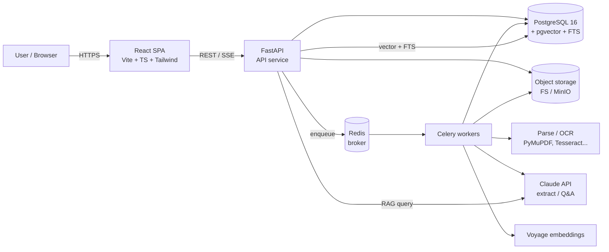
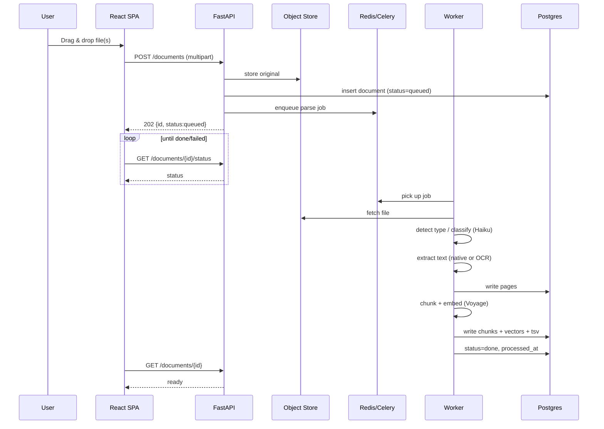
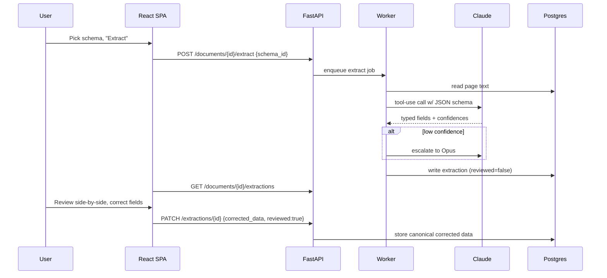
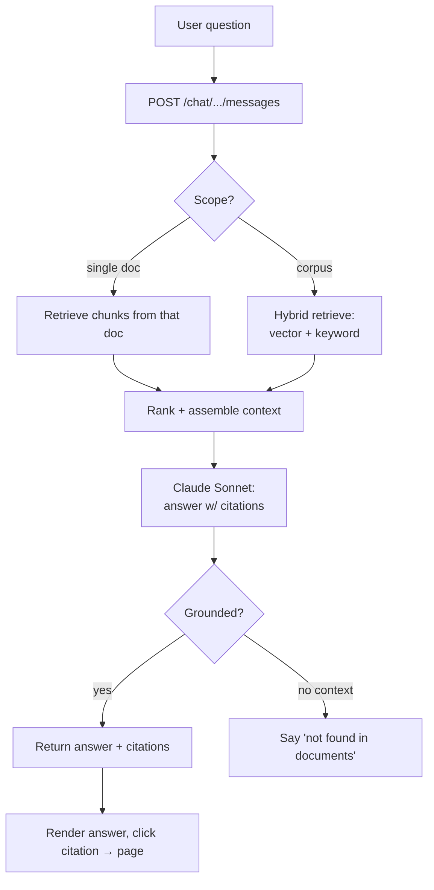
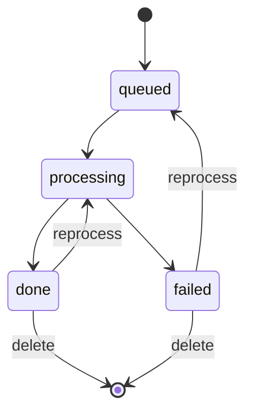
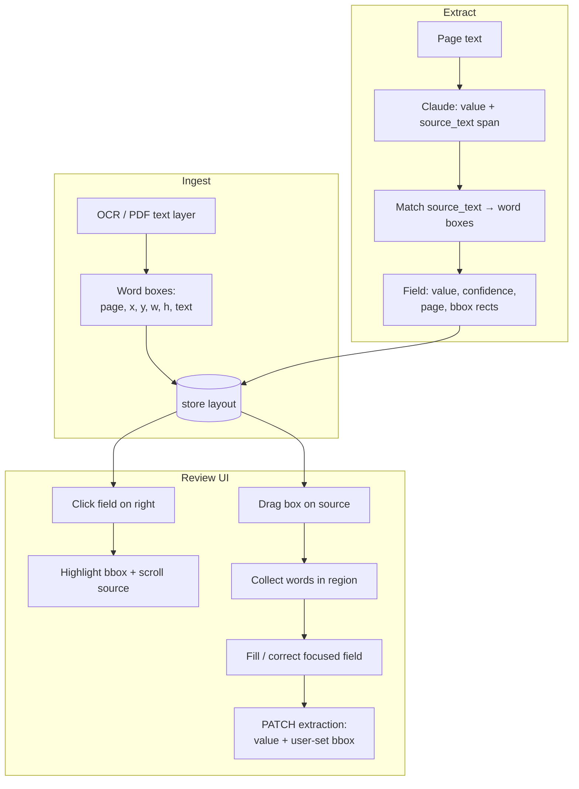
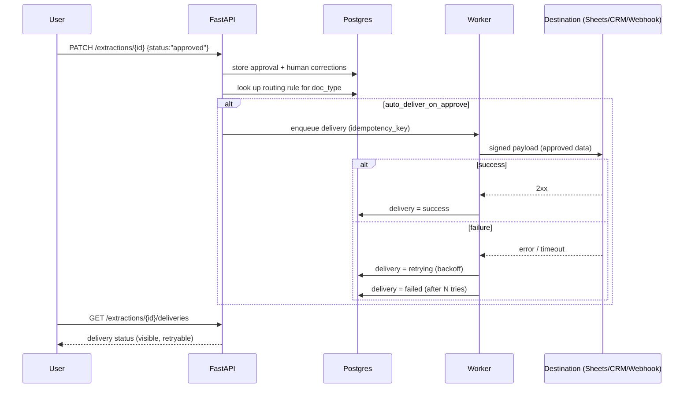

# System Architecture — DocuParse

> **Status:** Draft v0.1 · Pairs with `PRD.md` and `TRD.md`
> Covers: high-level architecture, app flows, and wireframes.
> Mermaid diagrams render in most Markdown viewers (GitHub, VS Code with a Mermaid extension, Obsidian).

## 1. High-level architecture



**Separation of concerns**
- **API service** — stateless request/response, auth, validation, orchestration, streaming Q&A.
- **Workers** — all heavy/slow work (parse, OCR, LLM extraction, embeddings) off the request path.
- **Postgres** — single source of truth: metadata, page text, extractions, vectors, full-text.
- **Object storage** — original binaries only.
- **Redis** — task broker + light cache.

## 2. App flows

### 2.1 Upload → processing pipeline


### 2.2 Structured extraction + review


### 2.3 Search & Q&A (RAG)


### 2.4 State machine for a document


### 2.5 Interactive review — bounding boxes & click-to-extract
How the two panes stay linked. This depends on **word-level bounding boxes** captured during OCR/parse and **grounded extraction** (each field carries the source span it came from).



Key point: the LLM returns each field **plus the exact source substring it used**; the backend locates that substring in the stored word boxes to compute the highlight rectangle(s). Click-to-extract runs the reverse — a user-drawn region is resolved to the words inside it. (See `audit.md` for why this matching is the hard part.)

### 2.6 Approve → deliver to integration
What happens when a reviewer hits Approve. Classification routes each document type to its mapped destination.



Delivery never happens silently or from a URL found inside a document — only to **user-configured** destinations, signed with HMAC. Failures surface in the UI with a retry.

## 3. Wireframes

Low-fidelity, layout-only. These define structure and key controls, not final visuals.

### 3.1 Document library (home)
```
┌───────────────────────────────────────────────────────────────┐
│  DocuParse            [ Search everything…            ] ( ⌕ )   │
│  ──────────────────────────────────────────────────────────    │
│  [ + Upload ]   Filters: [Type ▾] [Status ▾] [Date ▾]          │
│                                                                 │
│  ┌───────────────────────────────────────────────────────────┐ │
│  │ ▢  invoice_acme.pdf     PDF   ✔ done    2 pages   May 3    │ │
│  │ ▢  scan_receipt.jpg     IMG   ⏳ processing        May 3   │ │
│  │ ▢  q1_report.xlsx       XLSX  ✔ done    1 sheet   May 2    │ │
│  │ ▢  contract.docx        DOCX  ✖ failed  (bad file) May 1   │ │
│  └───────────────────────────────────────────────────────────┘ │
│                                    ‹ 1 2 3 … ›   [Export ▾]      │
└───────────────────────────────────────────────────────────────┘
```

### 3.2 Upload modal
```
┌──────────────── Upload documents ────────────────┐
│                                                   │
│      ┌───────────────────────────────────────┐   │
│      │    Drag & drop files here             │   │
│      │        or  [ Browse… ]                │   │
│      │  PDF · DOCX · XLSX · PNG · JPG (≤50MB) │   │
│      └───────────────────────────────────────┘   │
│                                                   │
│   invoice_acme.pdf  ▓▓▓▓▓▓▓▓░░  uploading         │
│   scan_receipt.jpg  ▓▓▓▓▓▓▓▓▓▓  queued            │
│                                                   │
│   Auto-extract with: [ Invoice v1 ▾ ] (optional)  │
│                              [ Cancel ] [ Done ]  │
└───────────────────────────────────────────────────┘
```

### 3.3 Document detail — extraction review (split view) ★ core screen

The primary workspace. Left = source document with bounding-box overlays; right = grouped, editable extracted data. **The two panes are linked both ways**: click a field → the source pans/zooms to its highlighted box; select text/drag a box on the source → it populates or corrects the focused field (click-to-extract).

```
┌── SOURCE  invoice_acme.pdf ──────────────┬── EXTRACTED DATA  (Invoice · 96% conf) ──┐
│  [◀ pg 1/2 ▶] [– zoom +] [⤢ fit] [OCR:no]│  [ ▸ Next flagged ]   Type: Invoice ▾ ✎ │
│                                          │                                          │
│  ┌────────────────────────────────────┐  │  ▾ DOCUMENT HEADER                       │
│  │  ACME CORP            ┌──────────┐  │  │    Vendor       [ Acme Corp        ] 🟢 │
│  │  123 Main St          │INV-0042  │◄─┼──┼─▶ Invoice #    [ INV-0042         ] 🟢 │
│  │                       └──────────┘  │  │    Date         [ 2026-05-01       ] 🟡⚠│
│  │  Bill to: …           Date: 05/01   │  │                                          │
│  │  ┌──────────────────────────────┐  │  │  ▾ LINE ITEMS  (3)          [+ add row]  │
│  │  │ Item      Qty  Price   Amount│  │  │   ┌─────────┬────┬────────┬──────────┐  │
│  │  │ Widget A   2   100.00  200.00│◄─┼──┼──▶│Item     │ Qty│  Price │   Amount │  │
│  │  │ …                            │  │  │   │Widget A │  2 │ 100.00 │   200.00 │  │
│  │  └──────────────────────────────┘  │  │   │…        │  … │      … │        … │  │
│  │            TOTAL DUE:  $5,230.00 ◄──┼──┼──▶└─────────┴────┴────────┴──────────┘  │
│  │  [x] Paid   [ ] Net-30              │  │   (text left-aligned · numbers right)   │
│  └────────────────────────────────────┘  │                                          │
│                                          │  ▾ SUMMARY                               │
│  ▓ highlight = selected field's source   │    Total        [ 5230.00          ] 🟡⚠│
│  drag on page → fill focused field       │    Paid?        [x] true (checkbox) 🟢  │
│                                          │                                          │
│  [ ⌕ find in doc ]  [ ↓ original ]       │  🟢 high 🟡 review 🔴 low  ⚠ needs check │
├──────────────────────────────────────────┴──────────────────────────────────────────┤
│  Extracted by claude-sonnet-5 · edited 2 fields · [ Reject / Flag ]   [ ✓ Approve ]  │
└───────────────────────────────────────────────────────────────────────────────────────┘
```

**Behaviors encoded above**
- **Bidirectional link (◄─►):** selecting `Invoice #`, a line-item cell, or `Total` on the right highlights and scrolls to its bounding box on the left, and vice-versa.
- **Grouping:** fields are collapsed under logical sections — *Document Header · Line Items · Summary* — to cut cognitive load.
- **Data table:** line items render as a spreadsheet-like grid; text columns left-aligned, numeric columns right-aligned; rows are editable and can be added/removed.
- **Confidence cues:** 🟢/🟡/🔴 plus a ⚠ flag and faded text on low-confidence fields; `▸ Next flagged` jumps straight to the next field needing review.
- **Direct editing:** any field/cell is click-to-edit; **click-to-extract:** drag a box on the source to fill the focused field from the document text.
- **Classification shown + correctable:** the detected `Type: Invoice ▾ ✎` can be changed, which re-runs the correct schema.
- **Approve workflow:** every doc has a clear `✓ Approve` / `Reject / Flag`; an edit summary shows what the human changed vs. the AI.

### 3.4 Search results
```
┌───────────────────────────────────────────────────────────────┐
│  ⌕  "invoices from Acme over $5k"     Mode: (•)Hybrid ( )KW ( )Sem │
│  ──────────────────────────────────────────────────────────────  │
│  invoice_acme.pdf · p.1 · score 0.94                            │
│    "…Total due $5,230.00 payable to Acme…"      [ Open ]        │
│                                                                 │
│  march_batch.pdf · p.4 · score 0.71                             │
│    "…Acme Corp line items, subtotal $6,110…"    [ Open ]        │
└───────────────────────────────────────────────────────────────┘
```

### 3.5 Q&A / chat (with citations)
```
┌───────────────────────── Ask your documents ─────────────────────┐
│  Scope: (•) Whole corpus   ( ) This document                      │
│                                                                   │
│  You:  How much did we pay Acme in May?                           │
│                                                                   │
│  DocuParse:  You paid Acme $5,230.00, invoiced 2026-05-01.        │
│              Sources:  [1] invoice_acme.pdf p.1                   │
│                                                                   │
│  ┌───────────────────────────────────────────────────────────┐   │
│  │ Ask a question…                                    [ Send ]│   │
│  └───────────────────────────────────────────────────────────┘   │
└───────────────────────────────────────────────────────────────────┘
```

### 3.6 Schema editor
```
┌──────────────── Extraction schema: Invoice v1 ────────────────┐
│  Name [ Invoice v1                    ]                        │
│  Desc [ Vendor invoices               ]                        │
│  ─────────────────────────────────────────────────────────    │
│  Field          Type       Required                            │
│  vendor         [string ▾]   [x]      [–]                       │
│  invoice_number [string ▾]   [ ]      [–]                       │
│  invoice_date   [date   ▾]   [ ]      [–]                       │
│  total          [number ▾]   [x]      [–]                       │
│  line_items     [array  ▾]   [ ]      [–]                       │
│                              [ + Add field ]                   │
│                                        [ Cancel ] [ Save ]     │
└───────────────────────────────────────────────────────────────┘
```

### 3.7 Processing progress (loading states)
Shown per document while the AI pipeline runs — a stepper, not a spinner, so heavy docs feel accountable.
```
┌──────────────── invoice_acme.pdf ────────────────┐
│                                                   │
│   ●━━━━━━━●━━━━━━━●━━━━━━━○━━━━━━━○                │
│  Upload  Classify  OCR    Extract  Index          │
│   done    done     done   ▓▓▓░░ 60%   —           │
│                                                   │
│   Extracting fields…  (this can take a moment     │
│   for large or scanned documents)                 │
│                                    [ Run in bg ]  │
└───────────────────────────────────────────────────┘
```
Steps map to the pipeline: **Upload → Classify → OCR/Parse → Extract → Index**. Failures mark the failed step red with a reason and a retry.

### 3.8 Review queue (managing many docs)
The list, filtered to what needs a human. Supports a fast keyboard-driven "open → review → approve → next" loop.
```
┌───────────────────── Review queue ──────────────────────┐
│  Filter: (•) Needs review  ( ) All   Type:[Any ▾]        │
│  ────────────────────────────────────────────────────    │
│  ⚠  invoice_acme.pdf     Invoice   2 flagged   [Review]  │
│  ⚠  contract_x.pdf       Contract  1 flagged   [Review]  │
│  ✓  receipt_12.jpg       Receipt   approved              │
│  ✖  scan_bad.png         —         failed      [Retry]   │
│  ────────────────────────────────────────────────────    │
│  [ ✓ Approve selected ]  [ Export selected ▾ ]           │
└──────────────────────────────────────────────────────────┘
```

### 3.9 Responsive fallback (narrow screens)
The split-screen assumes a wide viewport. On narrow/mobile widths, collapse to **tabs** — `[ Source | Data ]` — with the bounding-box tap-to-jump preserved, since two panes side-by-side don't fit.

### 3.10 Destinations & routing (integration settings)
Configure where approved data goes, and which document type routes where.
```
┌──────────────── Destinations ────────────────┐
│  [ + Add destination ]                        │
│  ───────────────────────────────────────────  │
│  📤 Invoices → Google Sheet   Sheets  ● on    │
│  📤 Contracts → CRM           CRM     ● on    │
│  📤 Generic webhook           Webhook ○ off   │
│                                                │
│  Routing rules                                 │
│  invoice   → Invoices → Google Sheet  [auto ✓] │
│  contract  → Contracts → CRM          [auto ✓] │
│  receipt   → (none)                   [manual] │
│              [ + Add rule ]   [ Test send ]    │
└────────────────────────────────────────────────┘
```

### 3.11 Edit summary (AI vs human diff)
Surfaced on the review screen (and per-document history) so changes are transparent.
```
┌──────────── Changes on this document ─────────┐
│  Field         AI extracted   →  Approved      │
│  Date          2026-01-05      →  2026-05-01 ✎ │
│  Total         5320.00         →  5230.00    ✎ │
│  Vendor        Acme Corp       (unchanged)     │
│  ───────────────────────────────────────────   │
│  2 fields corrected by a human before approval │
└────────────────────────────────────────────────┘
```

### 3.12 Error & empty states
Every dead-end has an explicit, helpful state — nothing fails silently.
```
Empty library (first run)  │  Failed parse
┌────────────────────────┐ │ ┌────────────────────────┐
│  No documents yet.     │ │ │ ✖ Couldn't read this   │
│  [ + Upload your first ]│ │ │   file (password-       │
│                        │ │ │   protected).           │
└────────────────────────┘ │ │        [ Retry ] [ ✕ ]  │
                           │ └────────────────────────┘
Nothing extracted          │  No search results
┌────────────────────────┐ │ ┌────────────────────────┐
│ No fields found. Try a │ │ │ No matches for "…".     │
│ different schema or     │ │ │ Try different words or  │
│ reclassify. [Reclassify]│ │ │ switch to semantic.     │
└────────────────────────┘ │ └────────────────────────┘
Empty review queue         │  Failed delivery
┌────────────────────────┐ │ ┌────────────────────────┐
│ 🎉 Nothing to review.  │ │ │ ⚠ Delivery to CRM failed│
│ All caught up.         │ │ │   (503). [ Retry now ]  │
└────────────────────────┘ │ └────────────────────────┘
```

### 3.13 Keyboard shortcuts (review loop)
Designed so a full review needs no mouse.
```
  ↑ / ↓  or  J / K    move between fields
  N                   jump to next flagged (low-confidence) field
  E  /  Enter         edit focused field
  [  /  ]             previous / next page of source
  A                   approve document
  X                   reject / flag document
  ⇧ + Enter           approve & open next document in queue
  /                   find in document
```

## 4. Cross-cutting concerns

- **Auth:** every route behind bearer token; SPA stores token in memory/secure cookie. No public registration.
- **Observability:** structured JSON logs; per-job timing; per-request `X-Request-Id`. Optional cost log per LLM call.
- **Failure isolation:** worker crashes/retries don't affect API availability; failed docs are visibly `failed` and retryable.
- **Security:** validate MIME server-side; sandbox/limit parser resource use; scrub file paths; never echo secrets; log all external LLM calls.
- **Data lifecycle:** deleting a document cascades to pages, chunks, vectors, and extractions; export before delete if needed. Delivery logs are retained for audit.
- **Integrations (outbound):** approved data is delivered only to user-configured destinations, HMAC-signed, with idempotency + retry + backoff; delivery status is always visible and never silent. Secrets are referenced, never stored in plain config.
- **Scaling path (Phase 2):** add worker replicas; move object storage to S3/MinIO; consider a dedicated vector store only if pgvector becomes the bottleneck.
